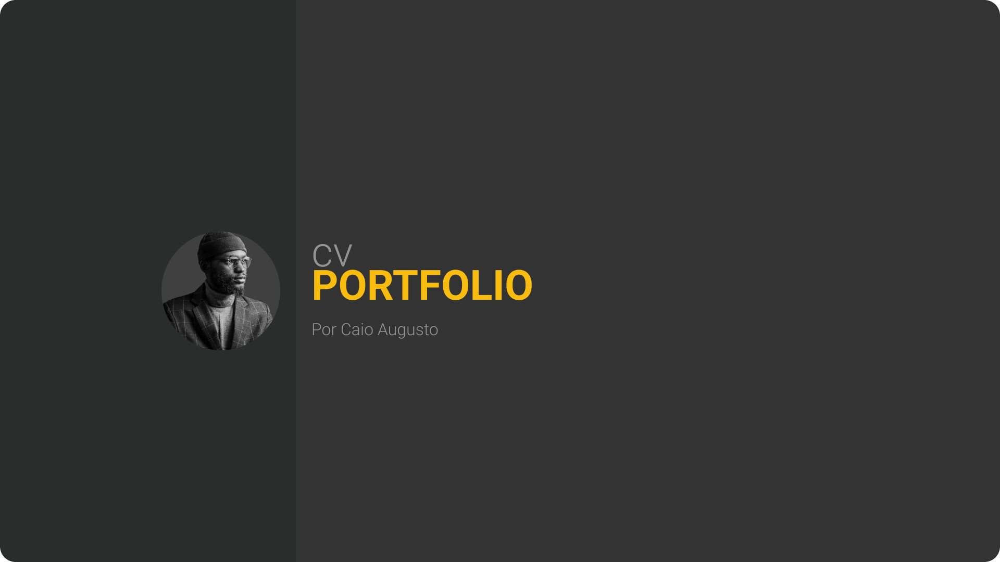

    

## 🖥️ Projeto

Esse é um projeto Web Responsivo de curriculum portfolio para ser usado por desenvolvedores Jr.

## 🚀 Tecnologias

Esse projeto foi desenvolvido por mim usando como principais tecnologias:

- Astro
- HTML
- Tailwind CSS
- Git e Github
- Vercel

## 󠁀🏷️ Layout

Você pode visualizar o layout do projeto através
[desse link](https://www.figma.com/community/file/1264969833590600564/cv-portfolio).
É necessário ter uma conta no [Figma](https://www.figma.com/) para poder clonar o projeto.

[Live preview](https://cv-portfolio-template-astro.vercel.app/)
